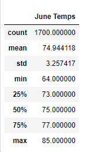
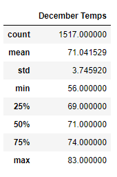
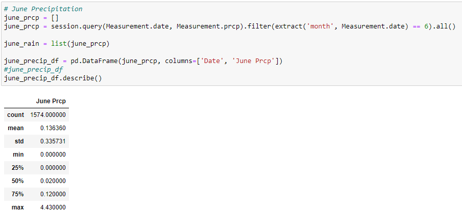
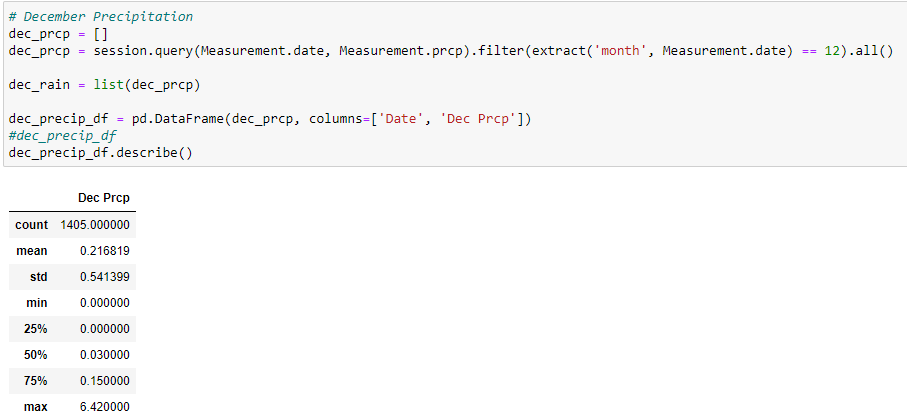

# surfs_up

## Overview of the Analysis
Using Python, Pandas functions, SQLite, and SQLAlchemy analyze temperature trends in Oahu to help W. Avy decide if his surf & ice cream shop is sustainable year-round.

## Results

- The mean temperature in June (74.94) was 3.9 degrees higher than the mean temperature in December (71.04). 
- The miniumum temperature in June (64) was a significant 8 degrees higher than the minimum temperature in December (56).
- Surprisingly, the max temperature in June (85) was only 2 degrees higher than the max temperature in December (83).
  - This bodes well for W. Avy's surf & ice cream business.

## Summary
The mean temperature data of June & December support W. Avy's surf & ice cream shop plan. The surprising max temperature of 83 in December is a nice bonus for W. Avy. The minimum December temperature is a sign of caution, it will most likely result in lower sales in December. However, the overall temperature seems to support this business plan.

We could also check on the levels of precipitation in June & December. 

We can see that there is quite a bit more precipitation in December. The business will still be viable, but probably have lower sales than in June.

